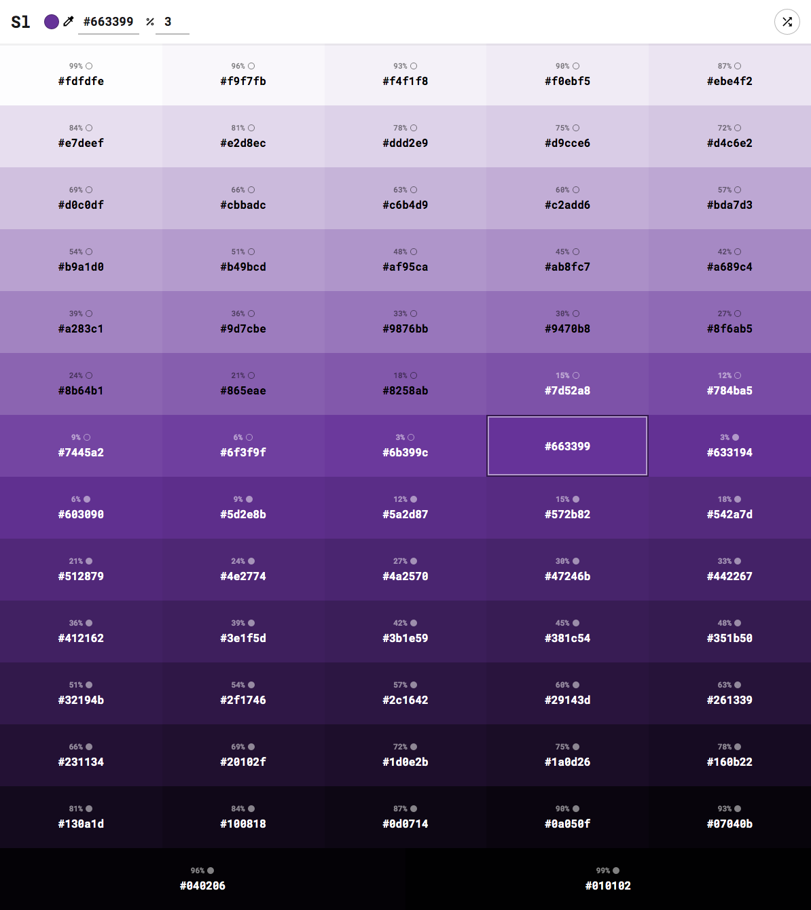

# Shadowlord

Simple color tints and shade generator using [values.js](https://github.com/noeldelgado/values.js).

https://noeldelgado.github.io/shadowlord/

## Related
- [values.js](https://github.com/noeldelgado/values.js) - JS library to get the tints and shades of a color

## License
MIT © [Noel Delgado](https://pixelia.me/)
